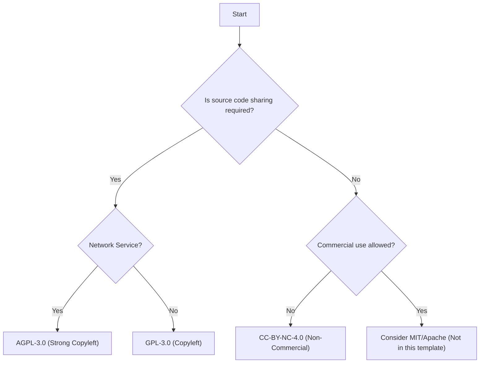

# Cookiecutter ML Project Template


Cookiecutter template for creating production-oriented Python ML repositories with:

- Hydra configuration (`config/`)
- DVC scaffolding (`data/`, `dvc.yaml`)
- MLflow tracking + registry conventions
- Optional Triton model repository layout
- Docker + optional Kubernetes/Helm skeleton
- GitHub Actions workflows (tests/lint/type-check/etc.)
- `uv`-first dependency management (lockfile-based)

This repository is the **cookiecutter wrapper** around an ML template repo. It exists to generate new project repositories quickly and consistently.

---

## License Selection Guide

This template offers three license options. Choose carefully based on your goals:

| License | Type | Best For |
| :--- | :--- | :--- |
| **GPL-3.0** | Copyleft | Open source projects where you want to ensure all forks remain open source. |
| **AGPL-3.0** | Strong Copyleft | Web services / APIs. Prevents the "SaaS loophole" by requiring source code sharing even for network deployments. |
| **CC-BY-NC-4.0** | Non-Commercial | Research/Personal projects. source available, but prevents others from making money off your work. |

### Decision Flowchart



---

## Quick start

### 1) Install prerequisites

- Python 3.12+ recommended
- Cookiecutter

Install cookiecutter (recommended via uv):

```bash
uv tool install cookiecutter
```

Or via pip:

```bash
python -m pip install --upgrade cookiecutter
```

### 2) Generate a new repository (interactive)

From wherever you want the new repo to be created:

```bash
cookiecutter gh:<owner>/cookiecutter-ml-project
```

Cookiecutter will prompt for values like:

- `repo_name`
- `project_title`
- `project_slug`
- `owner`

### 3) Generate non-interactively

```bash
cookiecutter gh:<owner>/<repo> --no-input \
  repo_name=my-ml-repo \
  project_slug=my_ml_repo \
  owner=acme \
  project_title="My ML Repo"
```

### 4) Choose output directory

Create the repo somewhere else:

```bash
cookiecutter gh:<owner>/<repo> -o /path/to/projects
```

---

## What gets generated

The generated project repository includes:

- `src/<project_slug>/` — production package
- `config/` — Hydra configuration groups
- `data/` — DVC-friendly structure
- `deployment/` — Docker, API skeleton, optional k8s/helm, Triton model repo layout
- `tests/` — unit/integration scaffolding
- `tools/` — repo hygiene scripts
- CI workflows preconfigured for `uv` and `uv.lock`

---

## Dependency management with uv

Generated repos are `uv`-first.

### Recommended workflow (generated repos)

Create and sync the environment:

```bash
uv sync --group dev
```

Run tests:

```bash
uv run pytest -m "not gpu and not slow"
```

Format + lint:

```bash
uv run ruff check . --fix
uv run ruff format .
```

Type check:

```bash
uv run mypy src
```

### Lockfile policy

Generated repos commit `uv.lock`. CI uses `uv sync` (locked install) for deterministic environments.

---

## GPU dependencies (opt-in)

GPU dependencies are defined as an optional extra in generated repos, but are **not installed by default**.

Example (generated repo):

```bash
uv pip install -e ".[gpu]" \
  --index https://download.pytorch.org/whl/cu130 \
  --index https://pypi.org/simple
```

CI never installs GPU extras.

---

## Docs build support (optional)

Generated repos can build docs if they include MkDocs or Sphinx config.

Docs tooling is expected to live in separate dependency groups so repos without docs don’t pay the dependency cost.

---

## Template maintenance workflow

This repo is intended to be kept in sync with an upstream “plain template repo”.

### Sync upstream template → cookiecutter template directory

```bash
./tools/sync_template_into_cookiecutter.sh /abs/path/to/ml-project-template
```

### Sync + smoke test generation

```bash
./tools/sync_and_smoke_test.sh /abs/path/to/ml-project-template
```

---

## Notes on templating and copy-without-render

Some files contain template-like syntax that must **not** be rendered by Jinja (Helm charts, GitHub Actions expressions like `${{ ... }}`, etc.). Those must be listed in `cookiecutter.json` under `_copy_without_render`.

---

## Release process (template repo)

This repository is versioned independently as a **template**.

Recommended process:

1. Ensure `Cookiecutter Smoke Test` CI is green on `main`.
2. Update `CHANGELOG.md` (template-level) with user-facing changes.
3. Tag a release:

```bash
git tag -a vX.Y.Z -m "cookiecutter template vX.Y.Z"
git push origin vX.Y.Z
```

4. (Optional) Create a GitHub Release for the tag and paste the changelog notes.

Notes:

- Generated projects are versioned separately in their own repositories.
- Template tags communicate “what changed in the generator”, not in any particular generated repo.

---

## Versioning

This cookiecutter template can be versioned and tagged independently. Tag releases with `vX.Y.Z`.

---

## License

This cookiecutter template is licensed under AGPL-3.0 unless stated otherwise.

>License note
>This repository is licensed under AGPLv3.
>
>Projects generated using this template are not required to be licensed under AGPLv3.
>Users are free to choose any license for their generated projects.
>
>The AGPLv3 license applies to the template itself and any modifications or redistributions of the template.
