# {{cookiecutter.project_title}}

<p align="center">
  <!-- Optional banner image -->
  
</p>

<p align="center">
  <!-- Version -->
  

  <!-- Python -->
  

  <!-- License -->
  

  <!-- CI -->
  

  <!-- Stack -->
  
  
  
  
</p>

> **One‑sentence summary of the project.**  
> Replace this text with a concise description of the problem and solution.

---

## Overview

Describe **what this project does** in practical terms:

- Problem being solved  
- Type of model / system  
- Expected inputs and outputs  
- Intended users or downstream systems  

Keep this section short and concrete.

---

## Key Features

- Single‑source configuration via **Hydra**
- Experiment tracking & model registry with **MLflow** (alias‑based lifecycle)
- Optional data versioning & pipelines with **DVC**
- Modular, testable code under `src/<{{cookiecutter.project_slug}}>/`
- Notebook‑driven research → production promotion workflow
- Deployment via **FastAPI**, **Docker**, **Kubernetes**
- Optional **Triton Inference Server** export for high‑performance inference
- CI‑driven linting, testing, and model promotion

---

## Repository Structure

```text
.
├── config/                 # Hydra configuration (single source of truth)
├── data/                   # Dataset layout (DVC‑tracked)
├── deployment/             # Docker, API, dashboards, k8s, Triton
├── docs/                   # Design docs, ADRs, figures
├── notebooks/              # Exploration & experiments
├── src/
│   └── <{{cookiecutter.project_slug}}>/     # Production Python package
├── tests/                  # Unit & integration tests
├── tools/                  # Repo hygiene & CI tooling
├── dvc.yaml                # Optional DVC pipeline stub
├── pyproject.toml          # Dependencies & version
├── CHANGELOG.md
├── TEMPLATE_GUIDE.md
└── README.md               # You are here
```

---

## Installation

This project uses **PEP 621** (`pyproject.toml`).

```bash
git clone <your-repo>
cd <repo>

# Recommended
uv pip install -e .
```

Optional extras:

```bash
uv pip install -e ".[notebooks]"
uv pip install -e ".[mlops]"
```

---

## Training

All training runs go through the Hydra entrypoint:

```bash
python -m <{{cookiecutter.project_slug}}>.cli.train
```

Example overrides:

```bash
python -m <{{cookiecutter.project_slug}}>.cli.train model=baseline trainer.fast_dev_run=true
```

Experiments are tracked in **MLflow** automatically.

---

## Evaluation

Offline evaluation logic lives under:

```text
src/<{{cookiecutter.project_slug}}>/evaluation/
```

Metrics and reports are logged via MLflow and/or written to `outputs/`.

---

## Inference

Reusable inference logic (no web code):

```text
src/<{{cookiecutter.project_slug}}>/inference/
```

This is consumed by:

- FastAPI service (`deployment/api`)
- Dashboards (`deployment/dashboards`)
- Batch or offline scripts

---

## Deployment

Supported deployment paths:

- **FastAPI** – flexible inference & business logic  
- **Dashboards** – Streamlit / NiceGUI demos (optional)  
- **Triton** – high‑performance tensor inference  

All deployments load models from the **MLflow Model Registry** using aliases
(`dev`, `staging`, `prod`, `archived`).

See:

```text
deployment/README.md
```

---

## Configuration

All configuration is defined under:

```text
config/
```

There is **no duplicated config** under `src/` and no `params.yaml`.

Overrides are applied via Hydra CLI or experiment configs.

---

## Development

Run tests:

```bash
pytest
```

Lint & format:

```bash
ruff check .
ruff format .
```

Notebook hygiene:

```bash
sh tools/setup_notebooks.sh
```

---

## Template Usage

If this repo was generated from the ML project template:

- Replace `<{{cookiecutter.project_slug}}>` everywhere
- Fill in all directory‑level README files
- Read **TEMPLATE_GUIDE.md** before modifying structure

---

## License

GPL‑3.0. See [LICENSE](LICENSE).
